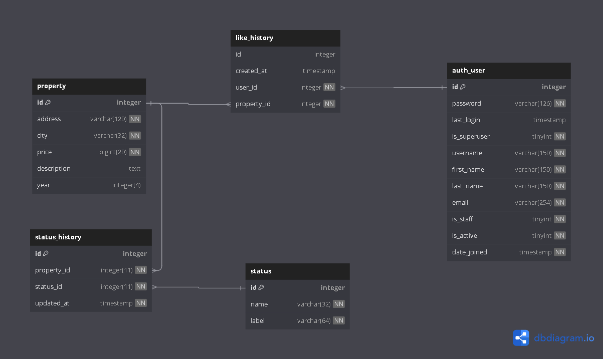
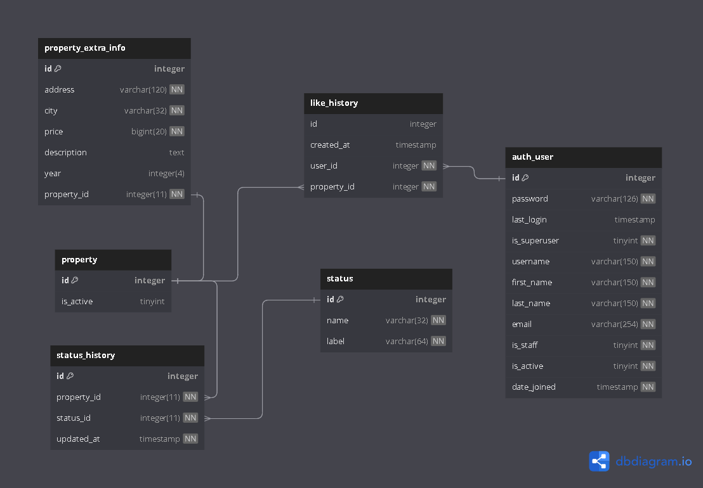

# Proyecto de propiedades

Este proyecto tiene como objetivo desarrollar un sistema en Python que recopile datos de una base de datos de propiedades y los procese para su posterior análisis. El sistema se basará en las siguientes tecnologías y bibliotecas:

## Tecnologías Utilizadas

- **Python 3.8+**: El lenguaje de programación principal utilizado en este proyecto.
- **pip**: Gestor de paquetes de Python para instalar y gestionar las dependencias del proyecto.
- **flake8**: Herramienta de verificación de código estático para garantizar la calidad y coherencia del código.
- **pytest**: Marco de prueba para realizar pruebas unitarias y de integración.
- **mysql-connector-python**: Biblioteca para conectarse a la base de datos MySQL y realizar operaciones de consulta.
- **json**: Biblioteca estándar de Python para manipular datos en formato JSON.
- **abc**: Módulo de la biblioteca estándar de Python utilizado para definir clases abstractas.
- **http**: Módulo de la biblioteca estándar de Python para realizar solicitudes HTTP.
- **logging**: Módulo de registro de Python para registrar eventos y mensajes relevantes.
- **dataclasses**: Decorador que simplifica la creación de clases de datos inmutables.
- **marshmallow**: Biblioteca de serialización y deserialización de objetos Python.
- **urllib**: Biblioteca de Python para realizar solicitudes HTTP y trabajar con URLs.


## Objetivo del Proyecto

El objetivo principal de este proyecto es crear un sistema Python que se conecte a una base de datos de propiedades, recopile datos relevantes y los procese según los requisitos específicos del usuario. Esto puede incluir la extracción de información, la generación de informes o la realización de análisis de datos.

## Plan de Desarrollo

El desarrollo de este proyecto seguirá un enfoque iterativo y se organizará en las siguientes etapas:

1. **Definición de Requisitos**: Se recopilarán y documentarán los requisitos del proyecto, incluyendo los tipos de datos que se deben extraer y procesar, y los resultados esperados.

2. **Diseño de la Arquitectura**: Se diseñará la arquitectura general del sistema, incluyendo la estructura de directorios, la interacción con la base de datos y el flujo de procesamiento de datos.

3. **Implementación**: Se desarrollarán los componentes del sistema utilizando las bibliotecas mencionadas y siguiendo las mejores prácticas de codificación. Se realizarán pruebas unitarias para garantizar la calidad del código.

4. **Pruebas y Validación**: Se realizarán pruebas exhaustivas para asegurarse de que el sistema funcione correctamente y cumpla con los requisitos definidos.

5. **Documentación**: Se elaborará una documentación completa que incluya instrucciones de instalación, uso y mantenimiento del sistema.

## Como correr el proyecto

1. Crear un archivo para las variables de entorno llamado .env
````commandline
DATA_USER_MYSQL=...
DATA_PASS_MYSQL=...
DATA_HOST_MYSQL=...
DATA_NAME_MYSQL=...
DATA_PORT_MYSQL=...
````
2. Correr el comando para instalar todos los requerimientos que se necesitan
````commandline
pip install -r .\requirements.txt
````
3. Correr el comando. El cual nos ayudara a realizar peticiones HTTP
````commandline
python habi/utils/server.py
````

## Dudas

¿Los datos que no tienen toda la información completa que se debería realizar con ellos?
  - Los datos que no tengan toda su información, no se mostraran al cliente en el front y no lanzara una excepción por falta de datos.

## Servicios

Para el primer servicio de obtener los datos de propiedades dependiendo los tres tipos de filtros que el cliente puede colocar que son:
-	Año de construcción
-	Ciudad
-	Estado del cliente

Este es un servicio GET ya que este su funcionalidad es de traer informacion y no afectar los registros.

Este es un ejemplo de las variables que se tienen que enviar dentro de la url
````json
{
    "year": "2000",
    "city": "bogota",
    "state": "pre_venta"
}
````

Este seria un ejemplo de la url para consumir el servicio con todos los filtros:
````http request
GET http://localhost:8080/get_properties?year=2000&city=bogota&state=pre_venta
````


# Solución segundo requerimiento

La solución que aplique fue colocar una tabla intermedia que sea de uno a muchos en las propiedades como también en los usuarios; Guardando en ella el id del usuario, el id de la propiedad y la fecha cuando le dio me gusta.

- **Nota**:
    - Se puede escalar agregando otro parámetro a la tabla de is_like. Observando el escenario de si el cliente en algún punto la propiedad ya no es de su agrado y quite el me gusta. Para saber cuándo lo hizo y si es un me gusta o no.



Esta es la query nueva para la tabla que me almacena cuando el cliente le dio me gusta a una respectiva propiedad

````sql
CREATE TABLE `like_history` (
  `id` int(11) NOT NULL AUTO_INCREMENT,
  `property_id` int(11) NOT NULL,
  `user_id` int(11) NOT NULL,
  `created_date` datetime NOT NULL DEFAULT CURRENT_TIMESTAMP,
  PRIMARY KEY (`id`),
  UNIQUE KEY `like_historial_id_uindex` (`id`),
  KEY `like_historial_property_id_fk` (`property_id`),
  KEY `like_historial_user_id_fk` (`user_id`),
  CONSTRAINT `like_historial_property_id_fk` FOREIGN KEY (`property_id`) REFERENCES `property` (`id`),
  CONSTRAINT `like_historial_user_id_fk` FOREIGN KEY (`user_id`) REFERENCES `auth_user` (`id`)
) ENGINE=InnoDB AUTO_INCREMENT=85 DEFAULT CHARSET=latin1;
````

# Mejoras base de datos
La mejora que realizaría a la base de datos actual seria dividir la tabla de propiedades, ya que contiene bastante información que se puede en otra tabla que tenga la información extra. Esto nos brindaría mejorar el rendimiento de las consultas y las operaciones de mantenimiento.

Y en la tabla de propiedades colocaría un parámetro extra de si esta activa o no para descartar las que no tienen la información completa y no se le puede visualizar al cliente.


